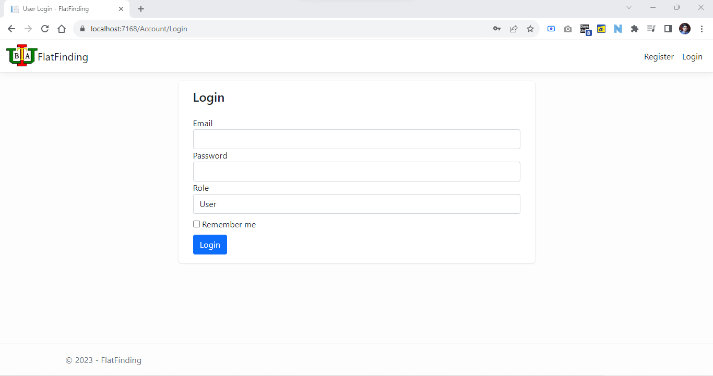

<b>Flat Finding</b> web Application 

It has some features: user can find available flat, booking payment and review on the other hand admin has dashboard to mantanance

Database Backup FlatFinding.bak to resotre Database 

<h4>Home Page</h4>

 
<h4>Register Page</h4>

 
<h4>Login Page</h4>

 
<h4>Create Flat</h4>

 

<h4>Search Flat Result</h4>

 
<h4>User Profile</h4>

 
<h4>Notice</h4>

 
<h4>Admin Dashboard</h4>

 
<h4>Generate Report</h4>

 
<h4>Generate PDF Report</h4>

 
<h4>Database Table</h4>

 
<h4>Database Table of Flats</h4>

 
<h2>Thank Your!</>